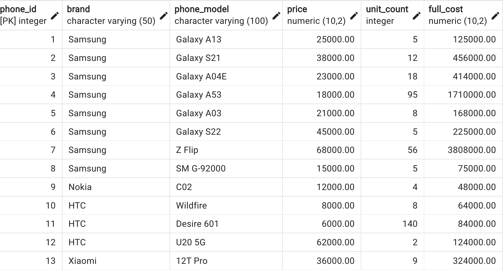
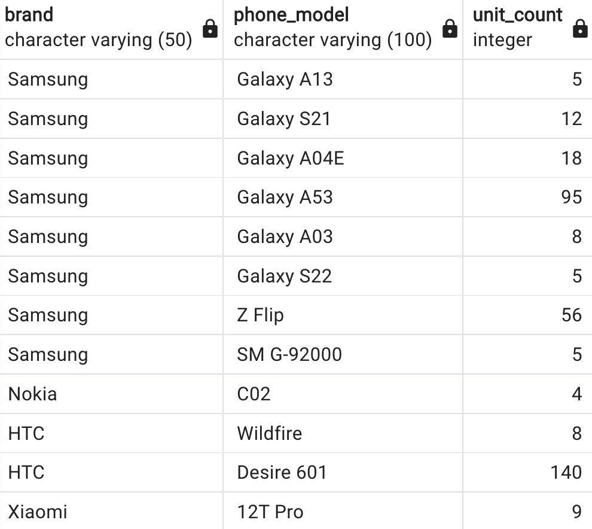
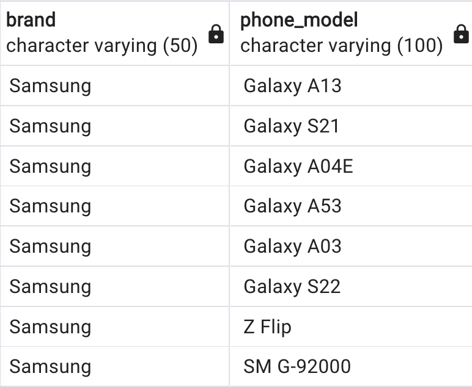
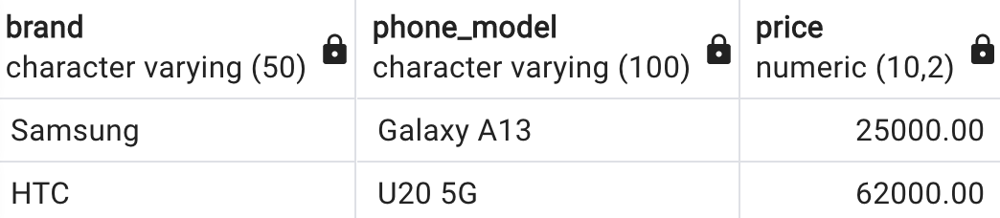
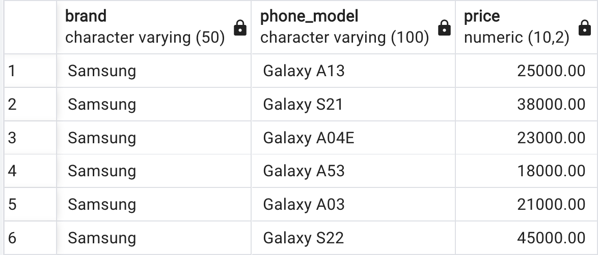
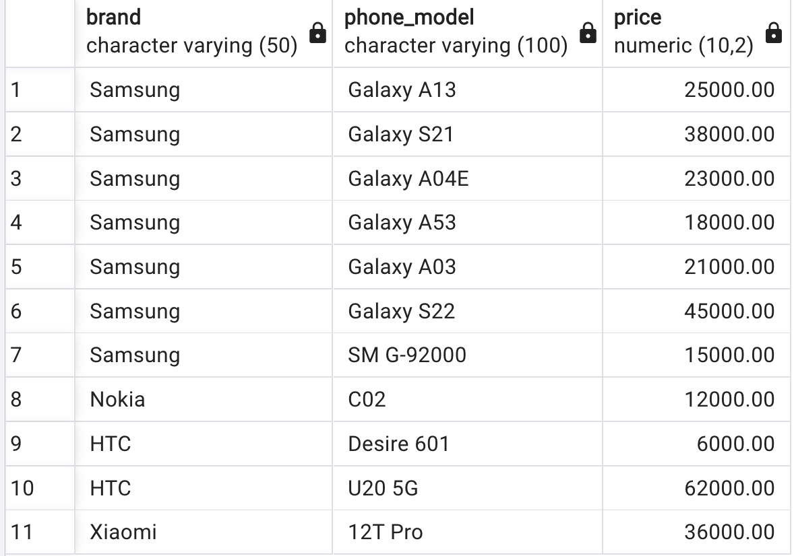

# Урок 1. Установка СУБД, подключение к БД, просмотр и создание таблиц
1. [Создайте таблицу с мобильными телефонами, используя графический интерфейс. Заполните БД данными.](/lesson1/Task_1.sql)

2. [Выведите название, производителя и цену для товаров, количество которых превышает 2](/lesson1/Task_2.sql)

3. [Выведите весь ассортимент товаров марки “Samsung”](/lesson1/Task_3.sql)

4. [Выведите информацию о телефонах, где суммарный чек больше 100 000 и меньше 145 000](/lesson1/Task_4.sql)

- Товары, в которых есть упоминание "Iphone"

Данные товары отсутствуют, выборка пуста

- "Galaxy"

- Товары, в которых есть ЦИФРЫ

- Товары, в которых есть ЦИФРА "8"

Данные товары отсутствуют, выборка пуста