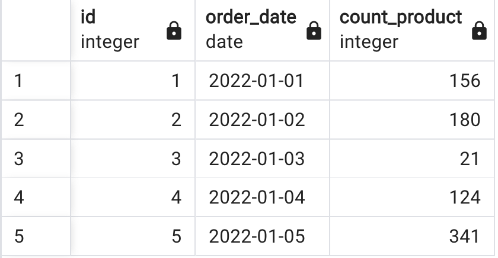
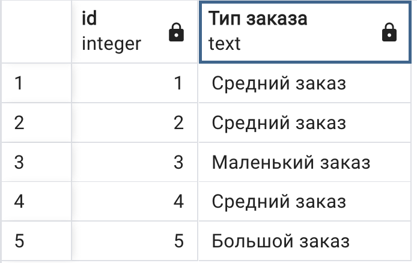
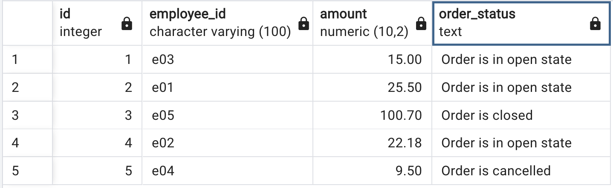

# Урок 1. Установка СУБД, подключение к БД, просмотр и создание таблиц
1. [. Используя операторы языка SQL,создайте таблицу sales. Заполните ее данными.](/lesson2/Task_1.sql)

2. [Для данных таблицы “sales” укажите тип заказа в зависимости от кол-ва :меньше 100  -    Маленький заказ от 100 до 300 - Средний заказ больше 300  -     Большой заказ](/lesson2/Task_2.sql)

3. [Создайте таблицу “orders”, заполните ее значениями.Выберите все заказы. В зависимости от поля order_status выведите столбец full_order_status: OPEN – «Order is in open state» ; CLOSED - «Order is closed»; CANCELLED -  «Order is cancelled»](/lesson2/Task_3.sql)

