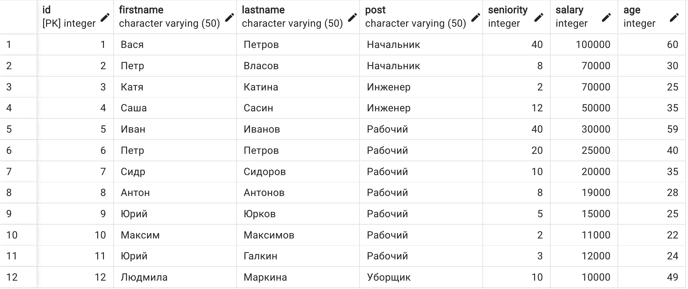
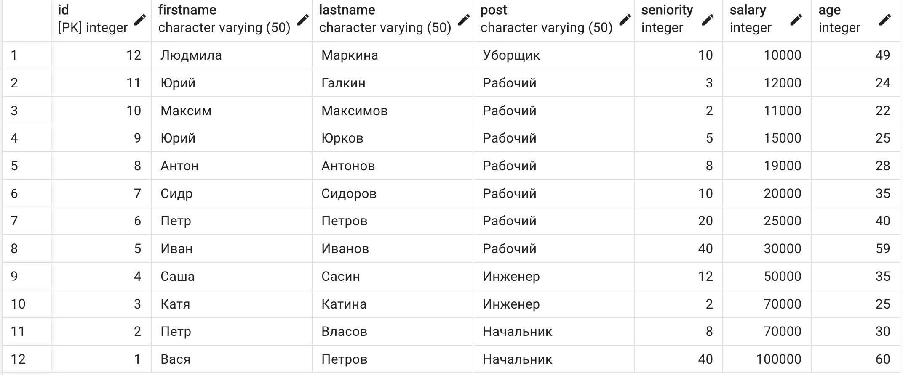
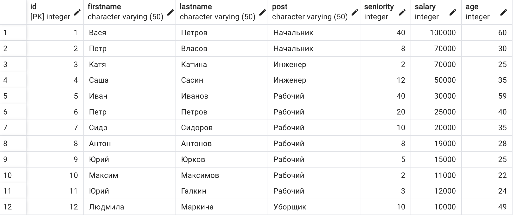
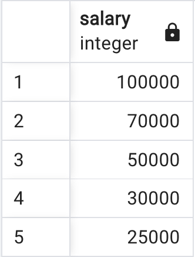
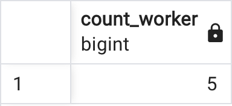
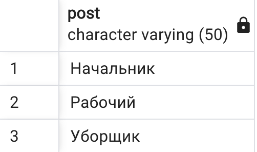

[Таблица staff для заданий](./create.sql)

[Отсортируйте данные по полю заработная плата (salary) в порядке: убывания; возрастания](./task1.sql)

--убывания

--возрастания

[Выведите 5 максимальных заработных плат (saraly)](./task2.sql)

[Посчитайте суммарную зарплату (salary) по каждой специальности (роst)](./task3.sql)

[Найдите кол-во сотрудников с специальностью (post) «Рабочий» в возрасте от 24 до 49 лет включительно.](./task4.sql)

[Найдите количество специальностей](./task5.sql)

[Выведите специальности, у которых средний возраст сотрудников меньше 30 лет](./task6.sql)
